# C4 Component Diagrams — WHMCS MCP Server (Golang Edition)

> **Target Codebase**: `whmcs-mcp` (Go 1.22+)  
> **Workspace**: `/home/ubuntu/workspace/plan/whmcs-mcp`  
> **Rujukan Baseline**: `plan/whmcs-mcp-tool/.ai-doc/C4-Component-Diagrams.md`  
> **Metode**: Evidence-based C4 Architecture Modeling (`ai-documentor`)  
> **Tanggal**: 2026-09-30  

Dokumen ini memodelkan arsitektur perangkat lunak level **C4 Component** untuk biner mandiri (*standalone single binary*) **WHMCS MCP Server (Golang)**, memetakan batas sistem (*system boundaries*), komponen internal paket Go, dan relasi integrasi ke sistem eksternal WHMCS.

---

## 1. WHMCS MCP Server Container (Go Runtime)

### Deskripsi
**WHMCS MCP Server** adalah aplikasi mandiri berbasis Go yang beroperasi sebagai middleware adaptif berkinerja tinggi antara LLM Host (klien MCP seperti Claude Desktop, Cursor, Zed, atau AI Agent) dan sistem billing hosting WHMCS. 

Server ini beroperasi secara *headless* melalui komunikasi standard I/O (stdio) JSON-RPC 2.0 dengan pemisahan ketat antara payload protokol di `os.Stdout` dan log diagnostik di `os.Stderr`. Transaksi data ke endpoint API WHMCS dieksekusi via HTTP/HTTPS POST menggunakan pooling `net/http.Client`.

---

### Diagram Komponen C4 (Mermaid)

```mermaid
C4Component
    title Component Diagram for WHMCS MCP Server (Golang Edition)

    Container(mcpClient, "MCP Client / Host", "Claude Desktop / Cursor / AI Agent", "Klien protokol MCP yang mengeksekusi tools, membaca resource, dan meminta prompt")
    
    Container_Boundary(whmcsMcpGo, "WHMCS MCP Server (Go Single Binary)") {
        Component(stdioTransport, "Stdio Transport", "os.Stdin / os.Stdout", "Menangani framing stream I/O JSON-RPC 2.0 dengan isolasi kanal logging ke os.Stderr")
        Component(mcpEngine, "MCP Server Engine", "mcp-go (server.MCPServer)", "Mengorkestrasi tool registration, prompt execution, resource routing, dan format respons JSON-RPC")
        Component(configLoader, "Config Loader", "internal/config", "Memuat dan memvalidasi environment variable WHMCS_URL, kredensial, dan timeout")
        Component(toolDispatcher, "Domain Tool Handlers", "internal/mcp/tools", "Mendaftarkan 62 tools domain (Client, Billing, Ticket, Domain, Order, Module, System)")
        Component(promptRegistry, "Prompts Registry", "internal/mcp/prompts", "Menyediakan 8 templat instruksi agen terstruktur (onboarding, fraud, tiket, revenue)")
        Component(resourceRegistry, "Resources Registry", "internal/mcp/resources", "Menyediakan akses langsung snapshot data sistem via skema URI whmcs://*")
        Component(whmcsClient, "WHMCS HTTP Client", "internal/whmcs/client.go", "Eksekutor HTTP POST, pooling koneksi, timeout management, dan evaluasi respon result=success/error")
        Component(paramSerializer, "Param Serializer", "internal/whmcs/serializer.go", "Mengonversi Go struct dan nested maps/slices menjadi application/x-www-form-urlencoded")
        Component(modelDto, "Domain Models & DTOs", "internal/model", "Struct strongly-typed untuk request parameters dan deserialisasi JSON API response")
        
        Rel(stdioTransport, mcpEngine, "Meneruskan frame JSON-RPC ke", "Go Channels / Scanner")
        Rel(mcpEngine, toolDispatcher, "Memetakan tools/call ke", "Go Function Callback")
        Rel(mcpEngine, promptRegistry, "Memuat pesan dari", "Go Function Callback")
        Rel(mcpEngine, resourceRegistry, "Membaca data resource dari", "Go Function Callback")
        Rel(toolDispatcher, whmcsClient, "Mengeksekusi API via", "Method Calls")
        Rel(resourceRegistry, whmcsClient, "Mengambil snapshot via", "Method Calls")
        Rel(whmcsClient, paramSerializer, "Mengonversi payload via", "Function Call")
        Rel(whmcsClient, modelDto, "Membaca/menulis struct via", "Type Definition")
        Rel(whmcsClient, configLoader, "Mengambil kredensial dari", "Config Struct")
    }

    System_Ext(whmcsGateway, "WHMCS API Gateway", "PHP /includes/api.php", "Titik masuk API administratif WHMCS")
    System_Ext(whmcsDatabase, "WHMCS Database", "MySQL / MariaDB", "Penyimpanan persisten data billing, tiket, akun, dan produk")
    System_Ext(serverModules, "Hosting Control Panels", "cPanel, Plesk, DirectAdmin", "Server eksternal untuk provisioning akun hosting")
    System_Ext(domainRegistrars, "Domain Registrars", "ResellerClub, Enom, LogicBoxes", "Pihak ketiga pendaftaran dan pengelolaan domain TLD")

    Rel(mcpClient, stdioTransport, "Mengirim JSON-RPC 2.0 via", "os.Stdin / os.Stdout")
    Rel(whmcsClient, whmcsGateway, "Mengirim HTTP POST form-urlencoded ke", "HTTPS (net/http)")
    Rel(whmcsGateway, whmcsDatabase, "Membaca dan menyimpan data ke", "SQL Query")
    Rel(whmcsGateway, serverModules, "Mengirim perintah modul (create, suspend, terminate) ke", "Module API")
    Rel(whmcsGateway, domainRegistrars, "Mengirim perintah domain (register, transfer, nameserver) ke", "Registrar API")
```

---

## 2. Rincian Komponen Internal

| Komponen | Paket / File Sumber | Tanggung Jawab & Peran |
|:---|:---|:---|
| **Stdio Transport** | `cmd/whmcs-mcp/main.go`, `mcp-go` | Mengelola loop pembacaan stream `os.Stdin` dan penulisan frame respons ke `os.Stdout`. Mengalihkan semua log diagnostik/debug ke `os.Stderr`. |
| **MCP Server Engine** | `github.com/mark3labs/mcp-go/server` | Mendaftarkan kapabilitas server, skema tool via JSON Schema reflection, penanganan siklus hidup koneksi, dan formatting pesan MCP. |
| **Config Loader** | `internal/config/config.go` | Membaca variabel lingkungan (`WHMCS_URL`, `WHMCS_API_IDENTIFIER`, `WHMCS_API_SECRET`, `WHMCS_API_ACCESS_KEY`, `WHMCS_TIMEOUT`), melakukan validasi URL, dan menyediakan fallback konfigurasi aman. |
| **Domain Tool Handlers** | `internal/mcp/tools/*.go` | Registrasi dan implementasi 62 tool MCP yang terbagi dalam domain terisolasi (`clients.go`, `billing.go`, `tickets.go`, `domains.go`, `orders.go`, `provisioning.go`, `system.go`, `marketing.go`). |
| **Prompts Registry** | `internal/mcp/prompts/prompts.go` | Menyediakan 8 templat instruksi agen terstruktur yang merespons RPC `prompts/get`. |
| **Resources Registry** | `internal/mcp/resources/resources.go`| Menyediakan 11 data provider yang merespons RPC `resources/read` dengan URI skema `whmcs://*`. |
| **WHMCS HTTP Client** | `internal/whmcs/client.go` | HTTP Client mandiri yang mengelola pooling koneksi (`http.Transport`), penambahan kredensial otomatis, timeout berbasis context, dan evaluasi hasil API (`result: success\|error`). |
| **Param Serializer** | `internal/whmcs/serializer.go` | Serializer khusus yang mengubah struct/map Go berjenjang menjadi format query string array multidimensi (`url.Values`) sesuai konvensi PHP WHMCS. |
| **Domain Models & DTOs** | `internal/model/*.go` | Definisi struct Go *strongly-typed* untuk argumen input tool, payload API WHMCS, dan objek entitas domain. |

---

## 3. Relasi & Alur Eksekusi Data

### 3.1 Alur Eksekusi Tool Call (`tools/call`)
1. **Host Request**: LLM Client mengirimkan request JSON-RPC `tools/call` melalui pipa `os.Stdin`.
2. **Engine Dispatch**: `MCPServer` memetakan nama tool ke fungsi handler di `internal/mcp/tools/`.
3. **Parameter Binding**: Parameter JSON di-unmarshal ke struct input DTO terkait di `internal/model/`.
4. **Client Invocation**: Handler memanggil metode pada `WhmcsClient`.
5. **Serialization**: `paramSerializer` menyusun payload `url.Values` (termasuk action, responsetype=json, dan token auth).
6. **HTTP Transmission**: `WhmcsClient` mengeksekusi HTTP POST ke `/includes/api.php` WHMCS.
7. **Response Unmarshaling**: Respon JSON WHMCS dievaluasi. Jika `result == "error"`, dikembalikan sebagai Go error; jika `success`, di-unmarshal ke struct respon DTO.
8. **Result Formatting**: Handler membungkus hasil menjadi `mcp.NewToolResultText(...)` dan `MCPServer` menuliskan JSON-RPC response ke `os.Stdout`.

### 3.2 Alur Resource Read (`resources/read`)
1. Host mengirimkan request pembacaan URI `whmcs://<resource-path>`.
2. `Resources Registry` mencocokkan URI path dan memanggil aksi API WHMCS terkait via `WhmcsClient`.
3. Respon data JSON sistem dibungkus dalam format konten resource MCP dan dikembalikan ke host.
