# Dokumentasi Komponen dan Use Case

> **Target Codebase**: `whmcs-mcp` (Go 1.22+)  
> **Workspace**: `/home/ubuntu/workspace/plan/whmcs-mcp`  
> **Rujukan Baseline**: `plan/whmcs-mcp-tool/.ai-doc/Dokumentasi-Komponen-Usecase.md`  
> **Metode**: Grouped Use Case Analysis (`ai-documentor`)  
> **Tanggal**: 2026-09-30  

---

## 1. Ringkasan

Dokumen ini mengelompokkan fungsionalitas **WHMCS MCP Server (Golang)** ke dalam 8 komponen domain modular yang kohesif, lalu menurunkan use case nyata yang dipetakan ke handler tool MCP (`internal/mcp/tools/`), model DTO (`internal/model/`), dan metode pemanggil HTTP API WHMCS (`internal/whmcs/`).

Dokumen ini memakai tiga status:
- `Ada / Siap`: use case telah terdefinisi secara spesifik dengan kontrak DTO dan rencana handler di Go.
- `Parsial`: fungsi tersedia namun memiliki dependensi konfigurasi modul/registrar pihak ketiga di sisi instalasi WHMCS.
- `Destructive`: tindakan berdampak permanen (penghapusan data, terminasi hosting, atau pembatalan transaksi).

Catatan validitas:
- Seluruh 8 komponen dan use case selaras dengan dokumen desain komponen (`DCD-01` s/d `DCD-08`).
- Komponen mencerminkan domain batas fungsional (*Domain Boundaries*) arsitektur Go yang bersih.

---

## 2. Diagram Use Case Tergrup

```plantuml
@startuml
left to right direction
skinparam packageStyle rectangle
skinparam monochrome false

actor "LLM Host / MCP Client" as ClientActor
actor "WHMCS Backend API" as WhmcsApi

package "Client Management Component" {
  usecase "Cari & Baca Data Klien" as UC_Client_Read
  usecase "Daftarkan & Perbarui Akun Klien" as UC_Client_Write
  usecase "Tutup Akun Klien" as UC_Client_Close
  usecase "Ambil Layanan, Domain, & Faktur Klien" as UC_Client_Rel
}

package "Billing & Invoicing Component" {
  usecase "Kelola Faktur & Item Tertagih" as UC_Bill_Invoice
  usecase "Catat Pembayaran & Tangkap Transaksi" as UC_Bill_Payment
  usecase "Kelola Mutasi & Saldo Kredit Klien" as UC_Bill_Credit
  usecase "Ubah Siklus Tagihan Produk Klien" as UC_Bill_UpdateProduct
}

package "Support Ticket Component" {
  usecase "Buka & Balas Tiket Bantuan" as UC_Ticket_OpenReply
  usecase "Kelola Status & Eskalasi Departemen" as UC_Ticket_Manage
  usecase "Ambil Templat Balasan Cepat" as UC_Ticket_Templates
}

package "Domain Lifecycle Component" {
  usecase "Cek WHOIS & Ketersediaan Domain" as UC_Domain_Whois
  usecase "Registrasi, Perpanjang, & Transfer Domain" as UC_Domain_Register
  usecase "Konfigurasi Nameserver, Lock, & EPP" as UC_Domain_Config
}

package "Order & Quote Component" {
  usecase "Buat & Setujui Pesanan Layanan" as UC_Order_Manage
  usecase "Tandai Fraud & Hapus Pesanan" as UC_Order_Fraud
  usecase "Kelola Penawaran Biaya (Quotes)" as UC_Quote_Manage
}

package "Server & Module Provisioning Component" {
  usecase "Provisioning Akun Hosting (Create/Suspend/Terminate)" as UC_Mod_Provision
  usecase "Ubah Paket Kuota & Password Hosting" as UC_Mod_Config
  usecase "Pantau Status Server & Kesehatan Sistem" as UC_Server_Health
}

package "System Administration Component" {
  usecase "Baca Statistik & Log Audit Aktivitas" as UC_Sys_Stats
  usecase "Kelola Tugas Administratif (To-Do Items)" as UC_Sys_Todo
  usecase "Kirim Email Notifikasi Langsung" as UC_Sys_Email
}

package "Prompts & Context Assistance Component" {
  usecase "Jalankan Orientasi Klien & Setup Produk" as UC_Prompt_Onboard
  usecase "Audit Keuangan & Penagihan Massal" as UC_Prompt_Finance
  usecase "Investigasi Fraud & Kedaluwarsa Domain" as UC_Prompt_Audit
}

ClientActor --> UC_Client_Read
ClientActor --> UC_Client_Write
ClientActor --> UC_Client_Close
ClientActor --> UC_Client_Rel

ClientActor --> UC_Bill_Invoice
ClientActor --> UC_Bill_Payment
ClientActor --> UC_Bill_Credit
ClientActor --> UC_Bill_UpdateProduct

ClientActor --> UC_Ticket_OpenReply
ClientActor --> UC_Ticket_Manage
ClientActor --> UC_Ticket_Templates

ClientActor --> UC_Domain_Whois
ClientActor --> UC_Domain_Register
ClientActor --> UC_Domain_Config

ClientActor --> UC_Order_Manage
ClientActor --> UC_Order_Fraud
ClientActor --> UC_Quote_Manage

ClientActor --> UC_Mod_Provision
ClientActor --> UC_Mod_Config
ClientActor --> UC_Server_Health

ClientActor --> UC_Sys_Stats
ClientActor --> UC_Sys_Todo
ClientActor --> UC_Sys_Email

ClientActor --> UC_Prompt_Onboard
ClientActor --> UC_Prompt_Finance
ClientActor --> UC_Prompt_Audit

UC_Client_Read --> WhmcsApi
UC_Client_Write --> WhmcsApi
UC_Client_Close --> WhmcsApi
UC_Client_Rel --> WhmcsApi

UC_Bill_Invoice --> WhmcsApi
UC_Bill_Payment --> WhmcsApi
UC_Bill_Credit --> WhmcsApi
UC_Bill_UpdateProduct --> WhmcsApi

UC_Ticket_OpenReply --> WhmcsApi
UC_Ticket_Manage --> WhmcsApi
UC_Ticket_Templates --> WhmcsApi

UC_Domain_Whois --> WhmcsApi
UC_Domain_Register --> WhmcsApi
UC_Domain_Config --> WhmcsApi

UC_Order_Manage --> WhmcsApi
UC_Order_Fraud --> WhmcsApi
UC_Quote_Manage --> WhmcsApi

UC_Mod_Provision --> WhmcsApi
UC_Mod_Config --> WhmcsApi
UC_Server_Health --> WhmcsApi

UC_Sys_Stats --> WhmcsApi
UC_Sys_Todo --> WhmcsApi
UC_Sys_Email --> WhmcsApi
@enduml
```

---

## 3. Daftar Use Case per Komponen

### 3.1 Client Management Component
- **Status**: ✅ **Ada / Siap**
- **Reference**: `desain-component-document/DCD-01-Client-Management.md`
- **Target Kode**: `internal/mcp/tools/clients.go`, `internal/model/client.go`

**Deskripsi**:  
Mengelola seluruh siklus hidup profil pengguna/pelanggan di WHMCS, mulai dari pencarian, pembacaan detail profil, registrasi klien baru, pembaruan atribut kontak, penutupan akun, hingga agregasi riwayat layanan dan faktur.

**Use Case yang Terverifikasi**:
- ✅ `Cari & Baca Data Klien` (UC-CLI-01) — memetakan tool `whmcs_get_clients` dan `whmcs_get_client_details`.
- ✅ `Daftarkan & Perbarui Akun Klien` (UC-CLI-02) — memetakan tool `whmcs_add_client` dan `whmcs_update_client`.
- ⚠️ `Tutup Akun Klien` (UC-CLI-03, *Destructive*) — memetakan tool `whmcs_close_client`.
- ✅ `Ambil Layanan, Domain, & Faktur Klien` (UC-CLI-04) — memetakan tool `whmcs_get_client_products`, `whmcs_get_client_domains`, dan `whmcs_get_client_invoices`.

---

### 3.2 Billing & Invoicing Component
- **Status**: ✅ **Ada / Siap**
- **Reference**: `desain-component-document/DCD-02-Billing-and-Invoicing.md`
- **Target Kode**: `internal/mcp/tools/billing.go`, `internal/model/billing.go`

**Deskripsi**:  
Mengorkestrasi penagihan finansial, pembuatan faktur baru, pencatatan transaksi kas, penarikan otomatis melalui kartu kredit, penerapan kredit akun, dan pembaruan siklus langganan produk klien.

**Use Case yang Terverifikasi**:
- ✅ `Kelola Faktur & Item Tertagih` (UC-BIL-01) — memetakan tool `whmcs_get_invoices`, `whmcs_get_invoice`, `whmcs_create_invoice`, `whmcs_update_invoice`, `whmcs_create_billable_item`.
- ✅ `Catat Pembayaran & Tangkap Transaksi` (UC-BIL-02) — memetakan tool `whmcs_add_invoice_payment`, `whmcs_capture_payment`, `whmcs_get_transactions`, `whmcs_add_transaction`.
- ✅ `Kelola Mutasi & Saldo Kredit Klien` (UC-BIL-03) — memetakan tool `whmcs_apply_credit`.
- ✅ `Ubah Siklus Tagihan Produk Klien` (UC-BIL-04) — memetakan tool `whmcs_update_client_product`.

---

### 3.3 Support Ticket Component
- **Status**: ✅ **Ada / Siap**
- **Reference**: `desain-component-document/DCD-03-Support-Tickets.md`
- **Target Kode**: `internal/mcp/tools/tickets.go`, `internal/model/ticket.go`

**Deskripsi**:  
Menangani alur komunikasi bantuan teknis pelanggan, membuka tiket baru, mengirim respon balasan staf, memperbarui status tiket dan eskalasi departemen, serta memanfaatkan templat jawaban cepat (*predefined replies*).

**Use Case yang Terverifikasi**:
- ✅ `Buka & Balas Tiket Bantuan` (UC-TCK-01) — memetakan tool `whmcs_get_tickets`, `whmcs_get_ticket`, `whmcs_open_ticket`, `whmcs_reply_ticket`.
- ✅ `Kelola Status & Eskalasi Departemen` (UC-TCK-02) — memetakan tool `whmcs_update_ticket`, `whmcs_get_support_departments`, `whmcs_get_support_statuses`.
- ✅ `Ambil Templat Balasan Cepat` (UC-TCK-03) — memetakan tool `whmcs_get_ticket_predefined_cats`, `whmcs_get_ticket_predefined_replies`.

---

### 3.4 Domain Lifecycle Component
- **Status**: ✅ **Ada / Siap**
- **Reference**: `desain-component-document/DCD-04-Domain-Lifecycle.md`
- **Target Kode**: `internal/mcp/tools/domains.go`, `internal/model/domain.go`

**Deskripsi**:  
Mengelola seluruh siklus hidup domain, pengecekan ketersediaan WHOIS, pemesanan pendaftaran baru, perpanjangan, transfer masuk, perubahan nameserver, aktivasi proteksi ID, dan pengelolaan Registrar Lock.

**Use Case yang Terverifikasi**:
- ✅ `Cek WHOIS & Ketersediaan Domain` (UC-DOM-01) — memetakan tool `whmcs_domain_whois`, `whmcs_get_domains`.
- ✅ `Registrasi, Perpanjang, & Transfer Domain` (UC-DOM-02) — memetakan tool `whmcs_domain_register`, `whmcs_domain_renew`, `whmcs_domain_transfer`, `whmcs_domain_release`.
- ✅ `Konfigurasi Nameserver, Lock, & EPP` (UC-DOM-03) — memetakan tool `whmcs_domain_get_nameservers`, `whmcs_domain_update_nameservers`, `whmcs_domain_get_lock_status`, `whmcs_domain_update_lock_status`, `whmcs_domain_toggle_id_protect`, `whmcs_domain_request_epp`.

---

### 3.5 Order & Quote Component
- **Status**: ✅ **Ada / Siap**
- **Reference**: `desain-component-document/DCD-05-Order-and-Quote.md`
- **Target Kode**: `internal/mcp/tools/orders.go`, `internal/model/order.go`

**Deskripsi**:  
Mengatur penerimaan pesanan baru layanan hosting atau domain, persetujuan order, mitigasi penipuan (fraud check), pembatalan, dan administrasi surat penawaran biaya (*quotes*).

**Use Case yang Terverifikasi**:
- ✅ `Buat & Setujui Pesanan Layanan` (UC-ORD-01) — memetakan tool `whmcs_get_orders`, `whmcs_add_order`, `whmcs_accept_order`.
- ⚠️ `Tandai Fraud & Hapus Pesanan` (UC-ORD-02, *Destructive*) — memetakan tool `whmcs_cancel_order`, `whmcs_fraud_order`, `whmcs_delete_order`.
- ✅ `Kelola Penawaran Biaya (Quotes)` (UC-ORD-03) — memetakan tool `whmcs_get_quotes`, `whmcs_accept_quote`.

---

### 3.6 Server & Module Provisioning Component
- **Status**: ✅ **Ada / Siap**
- **Reference**: `desain-component-document/DCD-06-Server-and-Module-Provisioning.md`
- **Target Kode**: `internal/mcp/tools/provisioning.go`, `internal/model/provisioning.go`

**Deskripsi**:  
Menjembatani instruksi kontrol akun hosting ke server remote (cPanel, Plesk, dll.) melalui modul WHMCS, memantau daftar server aktif, dan memeriksa metrik kesehatan sistem.

**Use Case yang Terverifikasi**:
- ⚠️ `Provisioning Akun Hosting` (UC-MOD-01, *Campuran Safe & Destructive*) — memetakan tool `whmcs_module_create`, `whmcs_module_suspend`, `whmcs_module_unsuspend`, `whmcs_module_terminate`.
- ✅ `Ubah Paket Kuota & Password Hosting` (UC-MOD-02) — memetakan tool `whmcs_module_change_package`, `whmcs_module_change_password`.
- ✅ `Pantau Status Server & Kesehatan Sistem` (UC-MOD-03) — memetakan tool `whmcs_get_servers`, `whmcs_get_health_status`.

---

### 3.7 System Administration Component
- **Status**: ✅ **Ada / Siap**
- **Reference**: `desain-component-document/DCD-07-System-Administration.md`
- **Target Kode**: `internal/mcp/tools/system.go`, `internal/model/system.go`

**Deskripsi**:  
Menyediakan utilitas administratif harian, audit keamanan log aktivitas, daftar pengguna staf, manajemen tugas to-do internal, daftar mata uang/gateway, serta pengiriman email pemberitahuan ke klien.

**Use Case yang Terverifikasi**:
- ✅ `Baca Statistik & Log Audit Aktivitas` (UC-SYS-01) — memetakan tool `whmcs_get_stats`, `whmcs_get_activity_log`, `whmcs_get_admin_users`, `whmcs_get_currencies`, `whmcs_get_payment_methods`.
- ✅ `Kelola Tugas Administratif (To-Do Items)` (UC-SYS-02) — memetakan tool `whmcs_get_todo_items`, `whmcs_get_todo_item_statuses`, `whmcs_update_todo_item`.
- ✅ `Kirim Email Notifikasi Langsung` (UC-SYS-03) — memetakan tool `whmcs_send_email`.

---

### 3.8 Prompts & Context Assistance Component
- **Status**: ✅ **Ada / Siap**
- **Reference**: `desain-component-document/DCD-08-Prompts-and-Context-Assistance.md`
- **Target Kode**: `internal/mcp/prompts/prompts.go`

**Deskripsi**:  
Menyediakan 8 alur instruksi sistem terstruktur yang dapat dipanggil oleh LLM Client untuk memandu operasional kompleks berbasis peran agen AI.

**Use Case yang Terverifikasi**:
- ✅ `Jalankan Orientasi Klien & Setup Produk` (UC-PRM-01) — memetakan prompt `client-onboarding`, `client-health-check`, `new-product-setup`.
- ✅ `Audit Keuangan & Penagihan Massal` (UC-PRM-02) — memetakan prompt `revenue-report`, `bulk-invoice-reminder`.
- ✅ `Investigasi Fraud & Kedaluwarsa Domain` (UC-PRM-03) — memetakan prompt `fraud-investigation`, `domain-expiry-audit`, `ticket-response`.

---

## 4. Catatan Pengelompokan & Sinkronisasi DCD

1. **Konsistensi Penamaan**: Nama 8 komponen di dokumen ini sinkron 1:1 terhadap berkas `DCD-01` s/d `DCD-08` di direktori `desain-component-document/`.
2. **Paritas MCP Tool**: 100% dari 62 tool MCP dan 8 prompt MCP terwakili dalam use case terverifikasi di atas.
3. **Eksekusi TDD**: Setiap use case menjadi acuan penyusunan unit test pada paket Go terkait.
