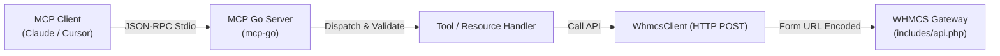

# Project Overview: WHMCS MCP Server (Golang Edition)

> **Dokumen**: Perancangan Awal Sistem Greenfield  
> **Target Sistem**: `whmcs-mcp` (Go 1.22+)  
> **Workspace**: `/home/ubuntu/workspace/plan/whmcs-mcp`  
> **Sumber Rujukan**: Spesifikasi Sistem Brownfield `plan/whmcs-mcp-tool/.ai-doc`  
> **Standar / Template**: `ai-documentor` (`project-overview-template.md`)  
> **Tanggal**: 2026-09-30  

---

## 1. Problem Statement

Aplikasi server referensi sebelumnya (`whmcs-mcp-tool`) dibangun menggunakan TypeScript/Node.js. Meskipun berhasil memetakan ekosistem WHMCS ke protokol Model Context Protocol (MCP), runtime berbasis Node.js memiliki sejumlah kendala praktis di lingkungan operasional:
1. **Runtime Overhead & Dependencies**: Membutuhkan ekosistem Node.js 18+ beserta direktori `node_modules` yang besar, memperumit distribusi lokal pada desktop klien LLM (seperti Claude Desktop atau Cursor).
2. **Konsumsi Memori & Latensi Startup**: Node.js membutuhkan alokasi memori yang relatif tinggi (100–200 MB RSS) dan waktu cold-start beberapa ratus milidetik, yang kurang optimal untuk server stdio yang sering di-spawn ulang oleh agen LLM.
3. **Container Size**: Image Docker berbasis Node Alpine berukuran lebih dari 150–200 MB, mempersulit deployment edge atau micro-service yang efisien.
4. **Tuntutan Reliabilitas Single-Binary**: Diperlukan implementasi mandiri (*standalone single binary*) tanpa dependensi runtime eksternal, berkinerja tinggi, hemat memori (< 25 MB), startup instan (< 10 ms), dan bertipe data ketat (*strongly typed*) untuk meminimalisir *runtime exceptions*.

---

## 2. Target Users & Stakeholders

| Role / Pihak | Deskripsi & Kebutuhan |
| :--- | :--- |
| **DevOps / SysAdmin Hosting** | Menjalankan server MCP lokal atau container untuk menghubungkan AI Assistant dengan infrastruktur hosting WHMCS tanpa repot instalasi Node.js. |
| **Billing & Support Operations** | Menggunakan AI Agent (Claude, Cursor, custom agent) untuk mengotomatisasi pengecekan invoice, status klien, balasan tiket bantuan, dan provisioning server secara instan. |
| **LLM Agents / MCP Clients** | Berinteraksi dengan antarmuka MCP standar via transport `stdio` (JSON-RPC 2.0) dengan latency rendah dan skema input/output yang valid. |
| **Platform Engineer / Developer** | Memelihara, memperluas endpoint, dan mendistribusikan biner Go multi-platform (Linux AMD64/ARM64, macOS Darwin, Windows). |

---

## 3. Assumptions

1. **WHMCS API Stability**: Target WHMCS API adalah versi 8.x ke atas yang mendukung autentikasi API Credential (`identifier` & `secret`) serta `$api_access_key` opsional, dengan gateway pemanggilan di `includes/api.php`.
2. **MCP Protocol Standard**: Mengikuti spesifikasi Model Context Protocol terkini (JSON-RPC 2.0 via Stdio Transport).
3. **Paritas Fungsional**: Implementasi Go harus mempertahankan fungsionalitas inti dari referensi `whmcs-mcp-tool`:
   - 62 MCP Tools (atau lebih) mencakup 12 domain operasional WHMCS.
   - 8 MCP Prompts untuk asistensi operasional agen.
   - 11 MCP Resources berbasis skema URI `whmcs://*`.
4. **Target Kompilasi**: Go 1.22+ dengan build biner statis (`CGO_ENABLED=0`).

---

## 4. Goals & Objectives

1. **Single Binary Distribution**: Menghasilkan satu berkas biner mandiri yang dapat langsung dijalankan oleh Claude Desktop/Cursor tanpa runtime tambahan.
2. **High Performance & Low Footprint**:
   - Penggunaan memori < 30 MB pada kondisi idle/operasional normal.
   - Cold start < 10 ms pada peluncuran proses stdio.
3. **100% Type-Safe API Client**: Mengimplementasikan Go client untuk WHMCS dengan struct strongly-typed untuk request parameters dan API responses, menggantikan penanganan dinamis/any.
4. **Clean Architecture & Maintainability**: Memisahkan layer Transport (MCP Stdio), Orchestration/Dispatcher, WHMCS HTTP API Client, dan Domain DTOs secara modular.
5. **Ultra-lightweight Container**: Menghasilkan Docker image berukuran < 25 MB berbasis image minimalis (`alpine` atau `scratch`).

---

## 5. Scope

### In Scope (Dalam Cakupan)
- **Core MCP Server (Go)**: Engine MCP kompatibel dengan JSON-RPC 2.0 Stdio transport.
- **Konfigurasi Environment**: Pemadanan variabel lingkungan dari `.env` atau OS env (`WHMCS_URL`, `WHMCS_API_IDENTIFIER`, `WHMCS_API_SECRET`, `WHMCS_API_ACCESS_KEY`, `WHMCS_TIMEOUT`, `WHMCS_DEBUG`).
- **WHMCS HTTP Client**:
  - HTTP POST form-urlencoded ke `includes/api.php` dengan serializer parameter hierarki/array (seperti customfields, nameservers, items).
  - Timeout, retry logic, dan validasi respon status API WHMCS (`result: success|error`).
- **MCP Tools Implementation (62 Tools)**:
  - *Client Management* (8 tools)
  - *Billing & Invoice* (11 tools)
  - *Support Ticket* (9 tools)
  - *Domain Management* (12 tools)
  - *Order & Quote* (8 tools)
  - *Server & Provisioning* (8 tools)
  - *System & Utilities* (6 tools)
- **MCP Prompts (8 Prompts)**: Penyediaan prompt workflow agen (onboarding, revenue audit, ticket reply, fraud check, dll.).
- **MCP Resources (11 Resources)**: Handler pembacaan data instan skema `whmcs://*`.

### Out of Scope (Di Luar Cakupan)
- Mengubah arsitektur internal WHMCS atau membuat addon modul PHP di dalam WHMCS.
- Transport jaringan jarak jauh (seperti HTTP SSE / WebSocket) pada fase rilis awal (fokus utama adalah `stdio` transport).
- Web dashboard visual bawaan (server murni beroperasi sebagai headless background agent provider).

---

## 6. High-Level System Direction

### 6.1 Pilihan Framework / SDK
- **MCP Go SDK**: Menggunakan library komunitas standar industri `github.com/mark3labs/mcp-go` yang mendukung spesifikasi resmi MCP, tool registration dengan JSON Schema reflection, prompt handler, dan resource handler melalui `server.NewMCPServer` serta `server.ServeStdio`.

### 6.2 Struktur Proyek Go (Standar Clean Architecture Go)
```text
whmcs-mcp/
├── .ai-doc/                   # Workspace dokumentasi sistem (control plane & arsitektur)
│   ├── 3p.md
│   ├── constitution.md
│   └── project-overview.md
├── cmd/
│   └── whmcs-mcp/             # Entry point aplikasi
│       └── main.go
├── internal/
│   ├── config/                # Loader variabel lingkungan & konfigurasi
│   │   └── config.go
│   ├── whmcs/                 # HTTP Client WHMCS & Serializer Parameter
│   │   ├── client.go
│   │   ├── options.go
│   │   └── serializer.go
│   ├── mcp/                   # Inisialisasi Server MCP & Pendaftaran Handler
│   │   ├── server.go
│   │   ├── tools/             # Registrasi MCP Tools per Domain
│   │   │   ├── clients.go
│   │   │   ├── billing.go
│   │   │   ├── tickets.go
│   │   │   ├── domains.go
│   │   │   ├── orders.go
│   │   │   ├── provisioning.go
│   │   │   └── system.go
│   │   ├── prompts/           # Registrasi 8 MCP Prompts
│   │   │   └── prompts.go
│   │   └── resources/         # Registrasi 11 MCP Resources
│   │       └── resources.go
│   └── model/                 # Struct DTO Request, Response, dan Domain Entities
│       ├── client.go
│       ├── billing.go
│       ├── ticket.go
│       ├── domain.go
│       ├── order.go
│       ├── provisioning.go
│       └── system.go
├── Dockerfile                 # Multi-stage Go build -> scratch / alpine
├── docker-compose.yml
├── .env.example
├── go.mod
└── go.sum
```

### 6.3 Pola Eksekusi Request


---

## 7. Key Constraints

1. **Stdio Protocol Strictness**: Kanal `os.Stdout` secara eksklusif diperuntukkan bagi frame JSON-RPC 2.0. Seluruh output log, pesan debug, dan error diagnostik **WAJIB** diarahkan ke `os.Stderr` untuk mencegah kerusakan framing protokol MCP.
2. **Parameter Encoding WHMCS**: Format API WHMCS menerima `application/x-www-form-urlencoded` dengan konvensi array multidimensi khusus (misal: `customfields[0]=val`), memerlukan custom URL value encoder di Go.
3. **Go Toolchain**: Kompatibel dengan Go 1.22+.
4. **Security & IP Access**: Mematuhi panduan keamanan Whitelisting IP WHMCS dan penyimpanan aman token autentikasi sesuai artefak `L-002`.

---

## 8. Prerequisite

1. Lingkungan build Go 1.22+ (`/usr/bin/go`).
2. Akses ke kredensial API WHMCS yang valid untuk pengujian fungsional terintegrasi.
3. Repositori referensi `plan/whmcs-mcp-tool/.ai-doc` sebagai sumber acuan kontrak skema REST API.

---

## 9. Catatan Diskusi

- **Pilihan Bahasa**: Golang dipilih untuk menggantikan TypeScript karena menghasilkan *single self-contained binary*, efisiensi memori tingkat tinggi, kemudahan distribusi ke pengguna akhir tanpa Node runtime, dan cold-start yang instan saat di-spawn oleh klien AI.
- **Pemanfaatan Dokumentasi Brownfield**: Seluruh 78 spesifikasi API action yang telah diverifikasi di `plan/whmcs-mcp-tool/.ai-doc/rest-api-doc/` dan 8 DCD di `desain-component-document/` akan dijadikan acuan pembuatan struct request/response Go agar 100% konsisten.

---

## 10. Risiko, Asumsi, dan Hal yang Perlu Dikonfirmasi

1. **Keputusan TDD (*TDD Decision Gate*)**:
   - Sesuai protokol `ai-documentor` (AD-GF), diperlukan konfirmasi eksplisit dari user:
     > *Apakah proyek `whmcs-mcp` ini ingin dikembangkan dengan pendekatan TDD (menulis unit/integration test terlebih dahulu untuk setiap behavior hingga `RED`, lalu menulis implementasi hingga `GREEN` dan refactor)?*
2. **Pustaka MCP Go**:
   - Pilihan default yang direkomendasikan adalah `github.com/mark3labs/mcp-go`. Apakah ada preferensi SDK atau framework lain yang diinginkan user?
3. **Cakupan Fase Awal**:
   - Apakah seluruh 62 Tools akan diimplementasikan sekaligus atau bertahap dimulai dari modul inti (*Client Management*, *Billing*, *Support Ticket*)?
